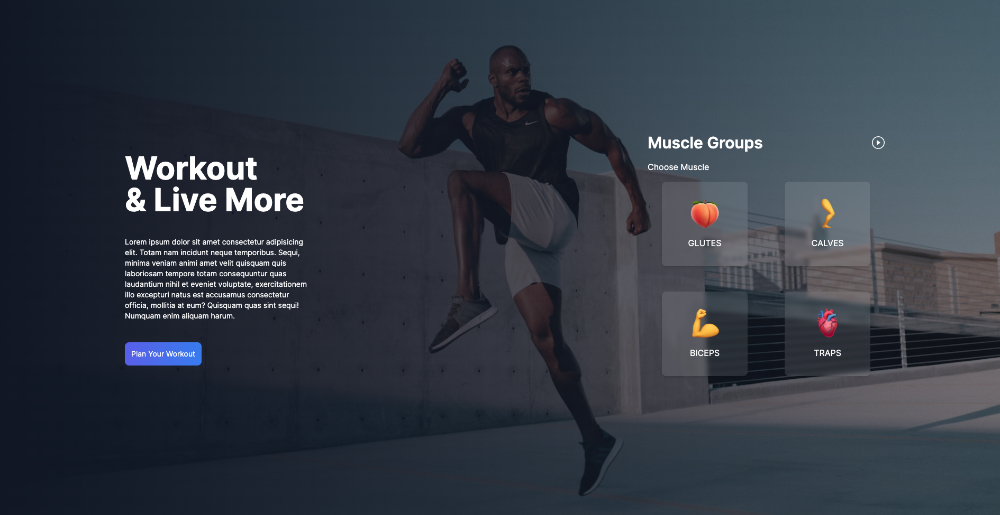

This is a [Next.js](https://nextjs.org/) project bootstrapped with [`create-next-app`](https://github.com/vercel/next.js/tree/canary/packages/create-next-app).

## Fitness Website Using NEXT13




First, run the development server:

```bash
npm run dev
# or
yarn dev
# or
pnpm dev
```

Open [http://localhost:3000](http://localhost:3000) with your browser to see the result.

## Project Description:

The Interactive Task Management App is a modern web application built using cutting-edge technologies, including Next.js 13, React hooks such as useRef and useState, Server-Side Rendering (SSR), Framer Motion for smooth animations, LocalStorage for seamless user experience, custom hooks for enhanced functionality, API calling for dynamic data integration, and Tailwind CSS for responsive and visually appealing UI design.

## Overview

In today's fast-paced world, staying organized and managing tasks efficiently is crucial. The Interactive Task Management App is designed to help users streamline their daily tasks, enhance productivity, and improve overall time management. This intuitive web application offers a feature-rich environment that harnesses the power of advanced technologies to provide a seamless and engaging user experience.
